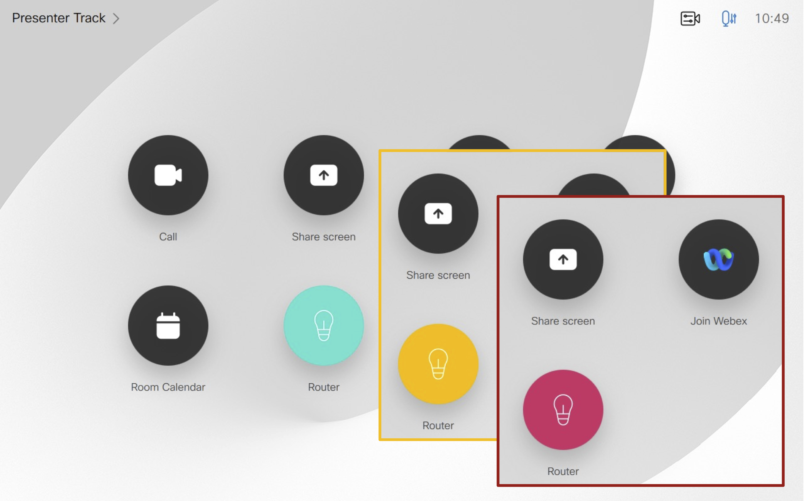
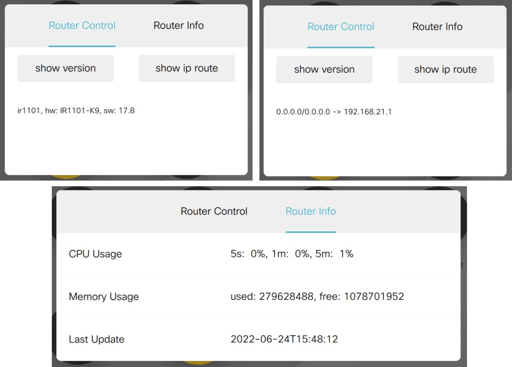
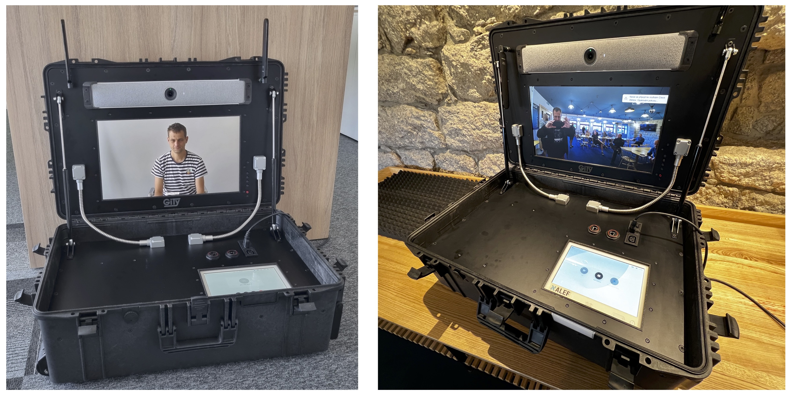
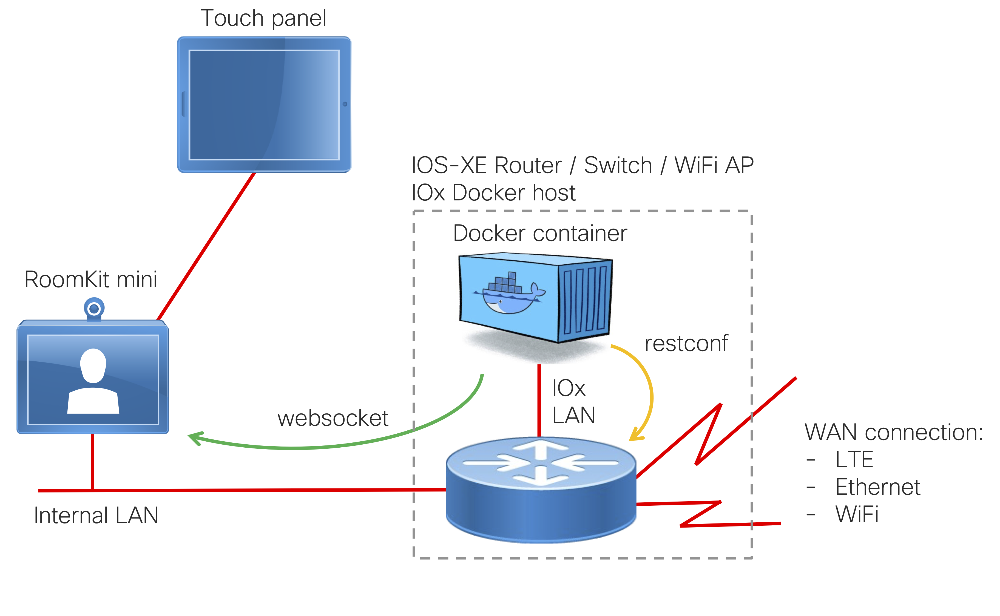
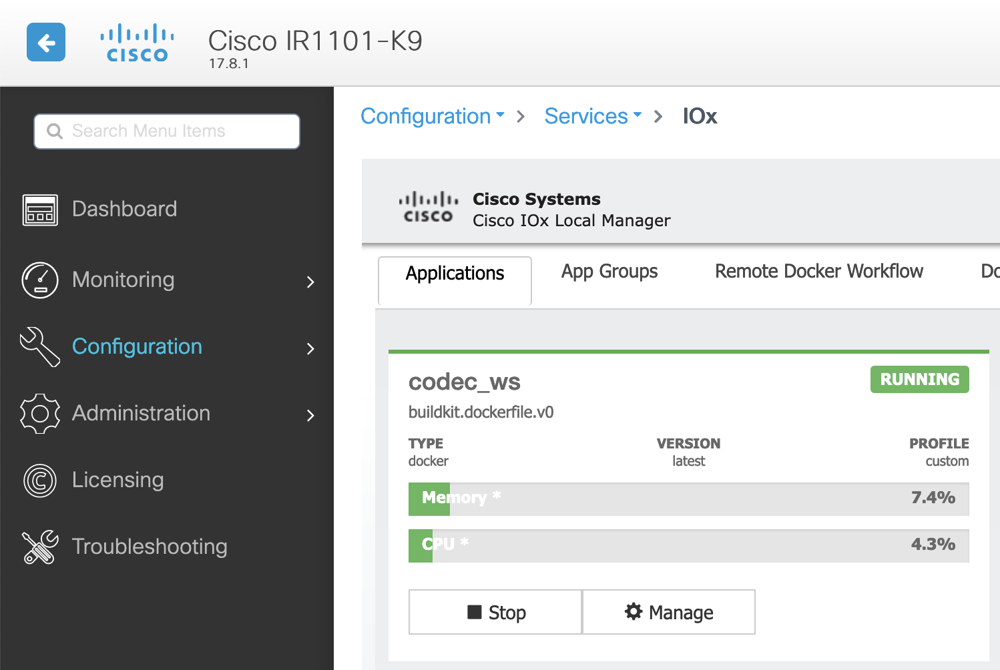
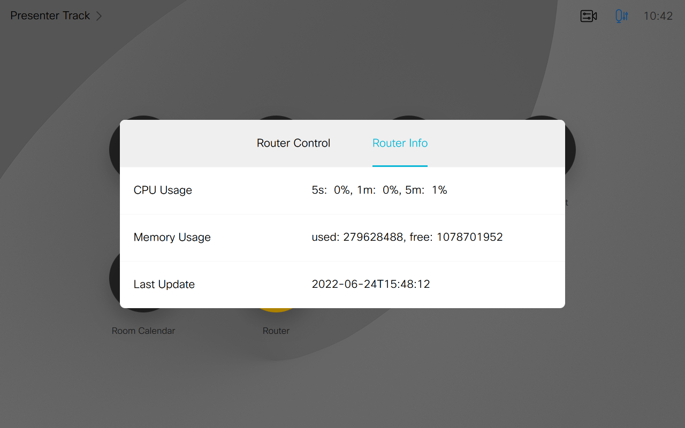

# Cisco router and codec integration
This is an example of integration between IOS-XE router (tested on IR1101) and Cisco video codec (RoomKit mini).
The goal was to create a proof of concept and to learn and test the websocket and Restconf communication.
The example was built for a ruggedized mobile video unit and provides router monitoring and control user interface on the Touch10
of the video codec. This way the user of the video device can for example check the connection quality or
switch from one type of connection to another. The example implements following features:
* color change of the panel button
* show command buttons for the HW/SW version and IP routing table
* periodic update of router CPU and memory utilization

Following technologies / techniques are used:
* [websocket](https://www.cisco.com/c/dam/en/us/td/docs/telepresence/endpoint/api/collaboration-endpoint-software-api-transport.pdf) for two-way communication with the codec API. It provides real-time, easy-to use interface.
* [Restconf]() for router monitoring and configuration changes
* [IOx](https://developer.cisco.com/site/iox/)-hosted Docker image 

  
  

## How it works
The mobile box consists of a Webex RoomKit mini or [Room Bar](https://projectworkplace.cisco.com/products/webex-room-bar), [Touch10](https://www.cisco.com/c/en/us/products/collateral/collaboration-endpoints/telepresence-touch/data_sheet_c78-646041.html) or [Navigator](https://projectworkplace.cisco.com/products/cisco-webex-navigator-table-version) and a LTE/Ethernet router.  

  

The application is hosted as a Docker image on the IOS-XE router using [IOx](https://developer.cisco.com/site/iox/). 
Following diagram shows the components and communication protocols:

  

**Websocket** channel is established in the direction from router to codec and is used both for sending commands to the codec
and for receiving notifications (feedback) from the codec - for example touch interface or call events.  
**Restconf** is used to get an information from the router. It can also be used to send configuration changes
or other commands to the router.

### Restconf
In order to create Restconf request [Cisco YANG Suite](https://developer.cisco.com/yangsuite/) is an essential tool
(get it from [Github](https://github.com/CiscoDevNet/yangsuite)).
YANG Suite can pull a list of YANG models from the router. Then the user can explore the YANG models and prepare a
Restconf query and its parameters. [Postman](https://www.postman.com/) can be then used for Restconf query testing. Some 
examples of Restconf queries can be found [here](https://www.cisco.com/c/en/us/td/docs/ios-xml/ios/prog/configuration/171/b_171_programmability_cg/restconf_protocol.html)

### IOx
[IOx](https://developer.cisco.com/site/iox/) is a virtualization environment and a set of management tools which allow to host [Cisco Guesthell](https://community.cisco.com/t5/developer-general-blogs/introducing-python-and-guest-shell-on-ios-xe-16-5/ba-p/3661394)
applications or Docker containers on Cisco IOS-XE routers and switches. Documentation and examples can be found [here](https://developer.cisco.com/docs/iox/).
Do not forget to check the [platform support matrix](https://developer.cisco.com/docs/iox/#!platform-support-matrix).

### Router configuration
Following is a router configuration for Restconf and IOx with Docker container **codec_ws**. The web server provides
access to Restconf API and to [WebUI](https://www.cisco.com/c/en/us/td/docs/routers/access/4400/software/configuration/xe-16-9/isr4400swcfg-xe-16-9-book/using_the_management_interfaces.html) for IOx applications management.  
```
aaa authentication login default local
aaa authorization exec default local 
aaa authorization network default local 
!
username admin privilege 15 password 0 admin
!
interface VirtualPortGroup0
 ip address 192.168.250.1 255.255.255.0
 ip nat inside
 ip virtual-reassembly
!
iox
ip http server
ip http authentication local
ip http secure-server
!
app-hosting appid codec_ws
 app-vnic gateway0 virtualportgroup 0 guest-interface 0
  guest-ipaddress 192.168.250.2 netmask 255.255.255.0
 app-default-gateway 192.168.250.1 guest-interface 0
 name-server0 192.168.21.50
 start
netconf-yang
restconf
```

### Codec configuration
Codec needs to be enabled for websocket communication:
1. create a new user
```
xcommand UserManagement User Add Username: roomcontrol Passphrase: roomcontrol123 PassphraseChangeRequired: False Role: RoomControl Role: Admin Role: User Role: Integrator YourPassphrase: my_admin_passphrase
```
2. enable HTTP+HTTPS and websocket access (currently the example is using HTTP):
```
xconfiguration NetworkServices HTTP Mode: HTTP+HTTPS
xconfiguration NetworkServices Websocket: FollowHTTPService
```

## How to run the application
This sample application can be run locally on a user's computer using just Python3 (preferably in [virtual environment](https://docs.python.org/3/tutorial/venv.html)) or as a Docker container. When it's packaged
for IOx, it can be deployed and run at any IOx router which supports Docker applications.

### Running locally in virtual environment
1. Clone this repository `git clone https://github.com/JardaMartan/mobile_box`
2. `cd mobile_box`
3. Create and activate virtual environment  `python3 -m venv venv`
4. Activate virtual environment `source venv/bin/activate` or `venv\Scripts\activate.bat`
5. Install required packages `pip install -r requirements.txt`
6. Copy **config_sample.py** to **config.py** and modify codec and router IP addresses and username/password entries.
Set TESTING["active"] to **True**:
```
TESTING = {
    "active": True,
```
7. Start the application `python codec_ws.py`

### Running locally as a Docker container
1. Get your Docker environment ready
2. Perform steps 1, 2 and 6 described in **Running locally in virtual environment**
3. Create Docker image `docker build -t myapps/codec_ws`
4. Run the Docker container `docker run -ti myapps/codec_ws`

### Deploying to IOx
1. Create Docker container as described in **Running locally as a Docker container**. The only exception is **router_ip**.
The application can determine the router IP address automatically by getting the default gateway of the Docker (IOx)
host. To use this feature, set the TESTING["active"] in config.py to **False**:
```
TESTING = {
    "active": False,
```
2. get and install the [ioxclient](https://developer.cisco.com/docs/iox/#!iox-resource-downloads), documentation can 
be found [here](https://developer.cisco.com/docs/iox/#!what-is-ioxclient).
3. create **pkg** directory `mkdir pkg`
4. use **ioxclient** to create IOx application `ioxclient docker package myapps/codec_ws pkg`
5. use router's CLI or WebUI to deploy, activate and start the application  

  

### Running the application
If all goes well, **Router** button should appear on video codec touch interface and **Router Info** panel
should automatically pop up.  

  
